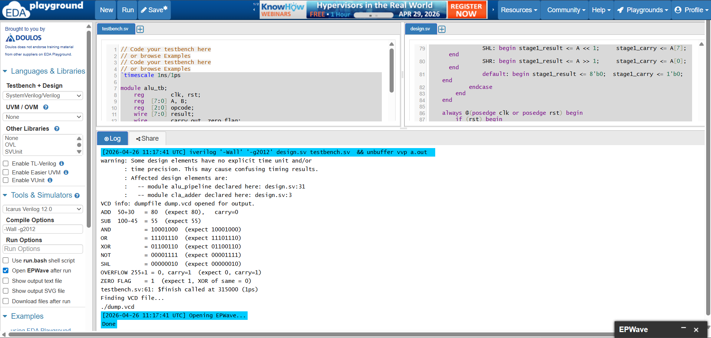
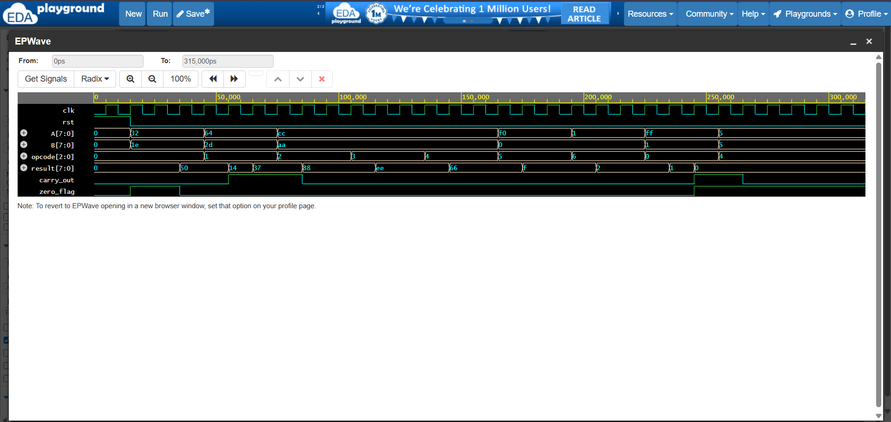

# 8-bit Pipelined ALU with Carry-Lookahead Adder

> A complete digital design project — from RTL in Verilog to gate-level synthesis — implementing a pipelined Arithmetic Logic Unit with a Carry-Lookahead Adder on the Sky130 130nm process.

**Author:** Ankit Banerjee | B.Tech ECE | NEHU Shillong  
**Tools:** Icarus Verilog · EDA Playground · EPWave · Yosys · Google Colab  
**Language:** Verilog HDL (IEEE 1364-2001)  
**Process:** Sky130 130nm Open-Source PDK

---

## Table of Contents

- [Overview](#overview)
- [Project Files](#project-files)
- [Supported Operations](#supported-operations)
- [Architecture](#architecture)
- [Simulation Results](#simulation-results)
- [Synthesis Results](#synthesis-results)
- [Tools and Flow](#tools-and-flow)
- [How to Run](#how-to-run)

---

## Overview

An ALU is the core circuit inside every processor — it performs all arithmetic and logic operations in hardware. This project designs one from scratch in Verilog HDL (the language used to describe real chips), rather than programming a computer in software.

Two key design choices make this ALU faster than a basic implementation:

**1. Carry-Lookahead Adder (CLA)**
A normal ripple-carry adder must wait for each bit's carry to propagate before computing the next bit — 7 sequential gate delays for 8 bits. The CLA computes all 8 carries simultaneously in parallel using Generate (G) and Propagate (P) signals, reducing addition delay to O(log n). This is the same approach used in modern processor designs.

**2. Two-Stage Pipeline**
The computation is split across two clock cycle stages. While Stage 2 is producing the output for operation N, Stage 1 is already computing operation N+1 — giving a throughput of one result per clock cycle after the initial 2-cycle startup latency.

---

## Project Files

| File | Description |
|------|-------------|
| [`rtl/cla_adder.v`](rtl/cla_adder.v) | Carry-Lookahead Adder — parallel carry computation for 8-bit addition |
| [`rtl/alu_pipeline.v`](rtl/alu_pipeline.v) | 2-stage pipelined ALU — top module, instantiates two CLA units |
| [`tb/alu_tb.v`](tb/alu_tb.v) | Testbench — 9 test cases covering all operations |

---

## Supported Operations

| Opcode | Operation | Description |
|--------|-----------|-------------|
| `000` | **ADD** | 8-bit unsigned addition with carry detection |
| `001` | **SUB** | Subtraction using 2's complement |
| `010` | **AND** | Bitwise AND |
| `011` | **OR** | Bitwise OR |
| `100` | **XOR** | Bitwise XOR |
| `101` | **NOT** | Bitwise NOT (inverts A, ignores B) |
| `110` | **SHL** | Logical shift left by 1 |
| `111` | **SHR** | Logical shift right by 1 |

**Output flags:**
- `carry_out` — high when addition result overflows 8 bits (e.g. 255 + 1 → 0, carry = 1)
- `zero_flag` — high when result is exactly zero

---

## Architecture

### Carry-Lookahead Adder — [`rtl/cla_adder.v`](rtl/cla_adder.v)

For each bit position, two signals are computed:
- **Generate: G[i] = A[i] AND B[i]** — this bit will produce a carry regardless of input carry
- **Propagate: P[i] = A[i] XOR B[i]** — this bit will pass an incoming carry through

All 8 carry values are then computed in one parallel step:

```
C[1] = G[0] | (P[0] & C[0])
C[2] = G[1] | (P[1] & G[0]) | (P[1] & P[0] & C[0])
...and so on for all 8 bits simultaneously
```

No waiting. All carries available at the same time. Final sum = P XOR C.

### Pipelined ALU — [`rtl/alu_pipeline.v`](rtl/alu_pipeline.v)

```
         Input: A, B, opcode
               │
    ┌──────────▼──────────┐
    │     STAGE 1         │  ← posedge clk
    │  CLA ADD / SUB      │
    │  AND / OR / XOR     │
    │  NOT / SHL / SHR    │
    │  stage1_result (8b) │
    │  stage1_carry  (1b) │
    └──────────┬──────────┘
               │
    ┌──────────▼──────────┐
    │     STAGE 2         │  ← posedge clk
    │  result    (8b)     │
    │  carry_out (1b)     │
    │  zero_flag (1b)     │
    └─────────────────────┘
         Output
```

Two CLA instances run in parallel — one for ADD, one for SUB (using 2's complement: B_neg = ~B + 1). The opcode selects which result passes to the Stage 1 register each cycle.

---

## Simulation Results

Simulated with **Icarus Verilog 12.0** on [EDA Playground](https://www.edaplayground.com). Waveform viewed in EPWave.

### All 9 Test Cases — Pass

| Test | A | B | Opcode | Expected | Result | Status |
|------|---|---|--------|----------|--------|--------|
| ADD | 50 `(0x32)` | 30 `(0x1E)` | `000` | 80 `(0x50)` | 80 | ✅ |
| SUB | 100 `(0x64)` | 45 `(0x2D)` | `001` | 55 `(0x37)` | 55 | ✅ |
| AND | `0xCC` | `0xAA` | `010` | `0x88` | `0x88` | ✅ |
| OR | `0xCC` | `0xAA` | `011` | `0xEE` | `0xEE` | ✅ |
| XOR | `0xCC` | `0xAA` | `100` | `0x66` | `0x66` | ✅ |
| NOT | `0xF0` | — | `101` | `0x0F` | `0x0F` | ✅ |
| SHL | `0x01` | — | `110` | `0x02` | `0x02` | ✅ |
| OVERFLOW | 255 | 1 | `000` | 0, carry=1 | 0, carry=1 | ✅ |
| ZERO FLAG | 5 | 5 | `100` | XOR=0, flag=1 | 0, flag=1 | ✅ |

> **Pipeline note:** Results appear 2 clock cycles after inputs are applied.
> This is correct and expected behavior — the 2-stage pipeline introduces
> 2-cycle latency while maintaining 1-result-per-cycle throughput.

### Simulation Console Output



### EPWave Waveform



*Signals shown top to bottom: `clk`, `rst`, `A[7:0]`, `B[7:0]`, `opcode[2:0]`, `result[7:0]`, `carry_out`, `zero_flag`. Values displayed in hexadecimal. The 2-cycle pipeline delay is visible between input changes and result updates.*

---

## Synthesis Results

Synthesized from Verilog RTL to gate-level netlist using **Yosys 0.9** with **ABC optimization**, targeting the **Sky130 130nm open-source process** (used in Google/SkyWater academic chip tapeouts).

### Summary

| Metric | Value |
|--------|-------|
| Cells before optimization | 455 |
| Cells after ABC optimization | **336** |
| Area reduction | **26.2%** |
| Pipeline registers (DFF) | **19** |
| Estimated cell area | **1,400 µm²** |
| Estimated total area (with routing) | **1,820 µm²** |
| Process node | Sky130 (130 nm) |
| Synthesis tool | Yosys 0.9 + ABC |

### Gate Breakdown — `alu_pipeline` Module (162 cells)

| Cell Type | Count | Role |
|-----------|------:|------|
| `$_OR_` | 42 | Carry propagation chain |
| `$_DFF_PP0_` | **19** | Pipeline stage registers |
| `$_ANDNOT_` | 18 | CLA generate logic (optimized) |
| `$_OAI4_` | 13 | 4-input Or-And-Invert (CLA carry) |
| `$_ORNOT_` | 12 | Carry chain optimization |
| `$_AOI4_` | 10 | 4-input And-Or-Invert (CLA carry) |
| `$_AND_` | 9 | Generate signals |
| `$_MUX_` | 9 | Opcode selection |
| `$_NOT_` | 9 | Logic inversions |
| `$_XOR_` | 9 | Sum: `P XOR C` |
| `$_XNOR_` | 6 | ABC-optimized equivalence |
| `$_AOI3_` | 2 | 3-input AOI |
| `$_OAI3_` | 2 | 3-input OAI |
| `$_NAND_` / `$_NOR_` | 2 | Misc logic |

Plus **2 × `cla_adder`** instances (87 cells each) = 174 additional cells.

### Key Observations

**Exactly 19 DFFs — design matches intent perfectly**
The pipeline registers break down as: 8-bit `stage1_result` + 1-bit `stage1_carry` in Stage 1 = 9 bits, plus 8-bit `result` + `carry_out` + `zero_flag` in Stage 2 = 10 bits. Total = **19**. No accidental latches, no missing registers.

**AOI/OAI compound gates in the CLA**
The synthesizer mapped CLA carry equations (naturally AND-OR structures) into compound AOI and OAI gates — implementing two logic levels in one physical gate. This reduces critical path delay compared to separate AND then OR gates. This is a standard optimization technique in real chip design.

**26% cell reduction through technology mapping**
Generic Yosys gates (455) vs real standard cells (336): compound gates like AOI4 replace multiple separate AND/OR gates, reducing both cell count and wire complexity.

**Zero memory cells**
Fully combinational + registered design. No latches, no RAM. Clean synchronous digital design.

---

## Tools and Flow

```
┌─────────────────────────────────────────┐
│  RTL Design                             │
│  cla_adder.v + alu_pipeline.v           │
│  Language: Verilog HDL                  │
└──────────────────┬──────────────────────┘
                   │
                   ▼
┌─────────────────────────────────────────┐
│  Functional Simulation                  │
│  Tool: Icarus Verilog 12.0              │
│  Platform: EDA Playground               │
│  Result: All 9 test cases pass ✅        │
└──────────────────┬──────────────────────┘
                   │
                   ▼
┌─────────────────────────────────────────┐
│  Waveform Verification                  │
│  Tool: EPWave                           │
│  Result: Pipeline behavior confirmed ✅  │
└──────────────────┬──────────────────────┘
                   │
                   ▼
┌─────────────────────────────────────────┐
│  RTL Synthesis                          │
│  Tool: Yosys 0.9 + ABC optimizer        │
│  Platform: Google Colab                 │
│  Target: Sky130 130nm process           │
│  Result: 336 cells, 1400 µm² area ✅    │
└─────────────────────────────────────────┘
```

---

## How to Run

### Option 1 — EDA Playground (no installation)

1. Go to [edaplayground.com](https://www.edaplayground.com) and create a free account
2. Select **Icarus Verilog 12.0** as simulator
3. Paste [`cla_adder.v`](rtl/cla_adder.v) + [`alu_pipeline.v`](rtl/alu_pipeline.v) into the **Design** panel
4. Paste [`alu_tb.v`](tb/alu_tb.v) into the **Testbench** panel
5. Check **Open EPWave after run** → click **Run**

### Option 2 — Local (Linux / WSL2)

```bash
# Clone the repository
git clone https://github.com/YOUR_USERNAME/8bit-pipelined-alu-verilog.git
cd 8bit-pipelined-alu-verilog

# Compile
iverilog -o alu_sim rtl/cla_adder.v rtl/alu_pipeline.v tb/alu_tb.v

# Simulate
vvp alu_sim

# View waveform
gtkwave dump.vcd
```

### Option 3 — Synthesis with Yosys

```bash
# Install Yosys
sudo apt install yosys

# Write synthesis script (synth.ys):
# read_verilog rtl/cla_adder.v
# read_verilog rtl/alu_pipeline.v
# hierarchy -check -top alu_pipeline
# synth -top alu_pipeline
# stat

yosys synth.ys
```

---

## About

Two-stage pipelined ALU with parallel CLA-based carry computation for reduced latency and high throughput.

It demonstrates the front-end digital design flow:  
RTL design → functional verification → synthesis → area analysis.

---

*October 2025 · Icarus Verilog · Yosys · Sky130 · Open Source*
